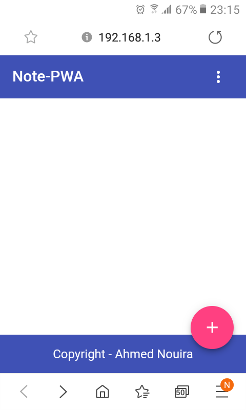

# lovely-offline-pwa-pwa

* This project was generated with [Angular CLI](https://github.com/angular/angular-cli) version 8.3.6.

* This Project is backed by **Firebase Firestore** as a real-time database.

* This Project uses **Angular Material** for styling.

# Overview 

## Development server

Run `ng serve` for a dev server. Navigate to `http://localhost:4200/`. The app will automatically reload if you change any of the source files.

## Build

Run `ng build` to build the project. The build artifacts will be stored in the `dist/` directory. Use the `--prod` flag for a production build.

## Deploy the App to Firebase Hosting 

1. Build the project using `ng build --prod`.
2. Install firebase CLI `npm install -g firebase-tools`. 
3. Login to your firebase acccount `firebase login`.
4. Run `firebase init` to initialize the project.

Upon the  initializing the project you'll be asked a few questions like: 

* Firebase CLI features.
* Databse rules file.
* Public directory: `dist/<your-project-name>` in this case `dist/user-management-app`.
* Configure as Single-Page-App: `y`.
* Overwrite `index.html`: `n`.

5. `firebase deploy` to deploy the application.

This application is available at https://lovely-offiline.web.app.